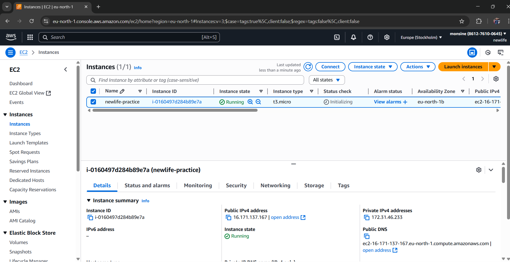
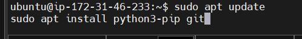

# Manual-Deployment-of-a-Flask-API-to-EC2
Objective:

Deploy a simple Flask API to an Amazon EC2 instance. After deployment, accessing /status on the EC2 public IP should return a JSON message confirming the deployment was successful.
________________________________________
-	The backend api is here: [github](https://github.com/royalteegee/newlife-practice.git)
-	After deployment, check http://<EC2_PUBLIC_IP>:5000/status, it should display the JSON success message: { "message": "deployment is SUCCESSFUL" }
________________________________________
Notes
•	Assume the EC2 instance is running Ubuntu.
•	Ensure that port 5000 is open in the EC2 security group.
•	The Flask app should not stop running after the SSH session ends.


---

## 🛠️ Step-by-Step Deployment Guide

### ✅ 1. **Prep Your EC2 Instance**
- Launch an EC2 instance using an **Ubuntu AMI**.
- Make sure your **security group** allows **inbound traffic on port 5000**:
  - Protocol: TCP
  - Port Range: 5000
  - Source: `0.0.0.0/0` (or restrict to your IP for security)

---

### 🔐 2. **SSH Into Your Instance**

Here i ssh into he instance using Mobaxterm
with the IP, username and the keypair


### 📦 3. **Install Required Packages**
Update and install Python, pip, and Git:
```bash
sudo apt update
sudo apt install python3-pip git -y
```


---

### 📁 4. **Clone Your Flask API from GitHub**
Replace with your actual repo URL:
```bash
git clone https://github.com/your-username/your-repo-name.git
cd your-repo-name
```


---

### 🧪 5.  Install the python3-venv Package
You have to install the ven package of the python 
```
Run:

sudo apt update
sudo apt install python3.12-venv
```

If you're using a different Python version (e.g. 3.10), replace python3.12-venv with python3.10-venv.


### 6. Create the Virtual Environment Again
Now that venv is available 
```
Run:

python3 -m venv venv
```

This should succeed and create the venv folder.

 ### 7. Activate the Virtual Environment
 ```
Run:

source venv/bin/activate
```

Your prompt should change to show you're inside the virtual environment.


 ### 8. Install Your Dependencies
If you have a requirements.txt file:
```
Run:
pip install -r requirements.txt

```
If not, you can install packages manually:
Run:
pip install flask


### 🧠 9. **Ensure Flask App Is Configured Correctly**
In your `app.py` or main file, make sure it runs like this:
```python
app.run(host='0.0.0.0', port=5000)
```
This makes it accessible from outside the EC2 instance.


Then to start it
```
Run: 

python app.py
```

To keep it running after logout
```
Run: 

nohup python app.py &


```


### 🌐 10. **Test the Deployment**
Open your browser and go to:
```
http://<EC2_PUBLIC_IP>:5000/status
```

You should see:
```json
{ "message": "deployment is SUCCESSFUL" }
```


---
